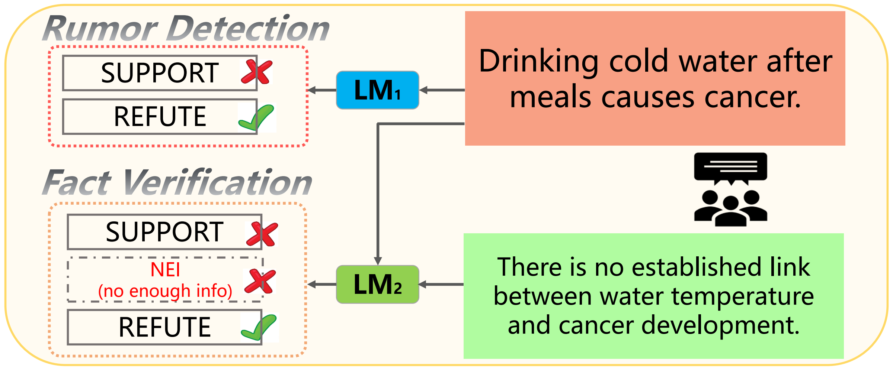
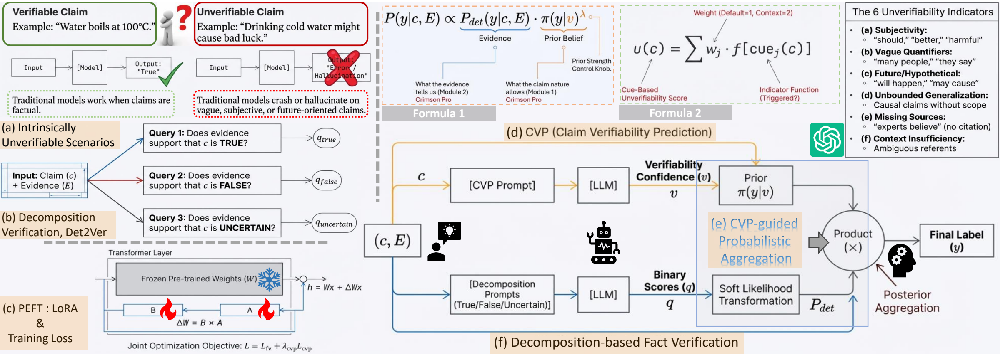
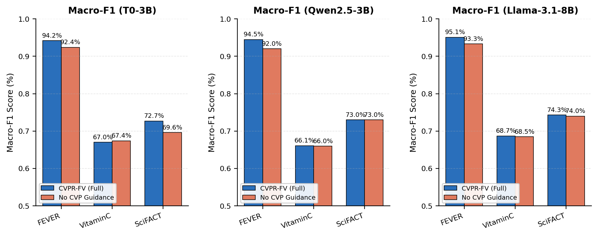
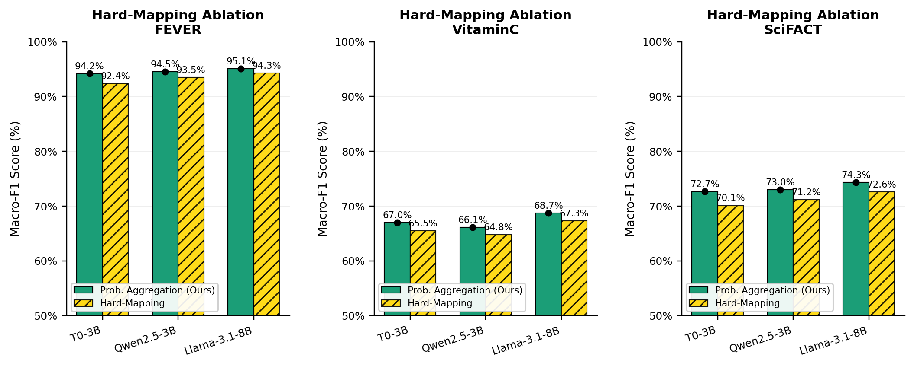
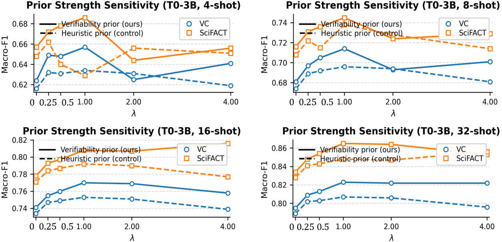
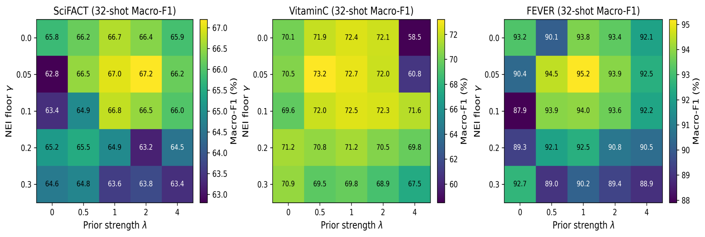

# CVPR-FV

**Claim Verifiability Prediction-based Rumor detection for Fact
Verification.** A verifiability-aware fact-verification framework that
extends Det2Ver with an auxiliary *Claim Verifiability Prediction* (CVP)
task and a *CVP-guided probabilistic aggregator* over the
decomposition-based intermediate judgments.

## Motivation

<p align="center">
  
</p>

Decomposition-based fact verification (Det2Ver-style) turns a ternary
verification decision into three binary yes/no judgments over
`true / uncertain / false` hypothesis states, then synchronises them
back into `{SUPPORT, REFUTE, NEI}` via a hard lookup table. This works
when the claim is genuinely falsifiable, but it becomes brittle for
claims that are **intrinsically unverifiable** — e.g. normative,
vague, or unfalsifiable statements — where the three binary judgments
frequently contradict each other and force the label synchroniser into
spurious flips.

## Framework

<p align="center">
  
</p>

CVPR-FV addresses this by adding two pieces on top of Det2Ver:

* **Claim Verifiability Prediction (CVP)** — an auxiliary head that
  estimates whether a claim is intrinsically verifiable
  (`v = p(Verifiable | c) ∈ [0, 1]`), trained with weak supervision
  from rumor-detection corpora using pseudo-verifiability labels.
* **CVP-guided probabilistic aggregation** — the three binary
  confidences `q_true, q_false, q_uncertain` are turned into soft label
  likelihoods, then combined with a verifiability-aware prior
  `π(y | v)^λ` in log-linear form:

  ```
  ℓ_Sup = q_true·(1-q_false)·(1-q_uncertain)
  ℓ_Ref = q_false·(1-q_true)·(1-q_uncertain)
  ℓ_NEI = q_uncertain·(1-q_true)·(1-q_false)
  π(NEI|v) = (1-v) + γ·v
  π(SUP|v) = π(REF|v) = (1-γ)·v / 2
  p(y|c,E) ∝ p_det(y) · π(y|v)^λ
  ```

Both heads share one LoRA-adapted backbone (T0-3B, Qwen2.5-3B, or
Llama-3.1-8B).

---

## What's new relative to Det2Ver

| Component | Det2Ver | CVPR-FV |
|-----------|---------|---------|
| Auxiliary task | Rumor detection (binary real/fake) | **Claim Verifiability Prediction** (`Verifiable / Unverifiable`) with pseudo-labels |
| Label synchronization | Hard lookup table + probability-ranking fallback | **Soft label likelihoods** + verifiability-aware prior `π(y\|v)^λ` |
| Backbones | T0-3B only | **T0-3B, Qwen2.5-3B, Llama-3.1-8B** (single CLI flag) |
| Reporting | Macro-F1 only | Macro-F1 **+ per-class F1** (`SUPPORT / REFUTE / NEI`) and mean±std over seeds |

---

## Directory layout

```
CVPR_FV/
├── configs.py               # global config (prompts, CVP cues, aggregator λ / γ, backbones)
├── utils.py                 # LoRA / (IA)^3 wrapper, seeding, helpers
├── cvp_pseudo_labeler.py    # heuristic u(c) score + weak-supervision label rule
├── data_reader.py           # FV + CVP datasets, consolidation prompting, DataModule
├── model.py                 # CVPR-FV LightningModule (joint loss + prob aggregation)
├── train.py                 # CLI entry point
├── requirements.txt
├── run_fs.sh                # few-shot experiments
├── run_zs.sh                # zero-shot experiments
├── run_ablations.sh         # ablation studies
├── data/
│   ├── fever_train.jsonl    FEVER / VitaminC / SciFACT
│   ├── scifact_*.jsonl
│   ├── vc_*.jsonl
│   ├── few_shot/            auto-created K-shot caches
│   └── rumor/
│       ├── liar_*.jsonl                LIAR   (8146 / 1036)
│       ├── fnn_*.jsonl                 FakeNewsNet (20877 / 2319)
│       ├── covid_*.jsonl               COVID-19 Fake News (6420 / 2140)
│       ├── prepare_rumor_data.py       raw → JSONL converter
│       ├── cvp_cache/                  auto-created CVP few-shot caches
│       └── few_shot/                   auto-created RD few-shot caches
└── output/                  auto-created experiment root
```

## Environment

```bash
conda create -n cvprfv python=3.10 -y
conda activate cvprfv
pip install -r requirements.txt
```

Backbone weights are resolved in this order:

| Env var | Backbone |
|---------|----------|
| `CVPRFV_T0_PATH`    | T0-3B local snapshot |
| `CVPRFV_QWEN_PATH`  | Qwen2.5-3B-Instruct local snapshot |
| `CVPRFV_LLAMA_PATH` | Llama-3.1-8B-Instruct local snapshot |

If none is set, `transformers` falls back to the HuggingFace hub
identifiers listed in `configs.BACKBONES`.

## Data

All six JSONL files are already committed. Every row of a fact
verification file looks like

```json
{"id": 42, "claim": "...", "gold_evidence_text": "...", "label": "SUPPORT"}
```

Every row of a rumor detection file:

```json
{"id": "liar_324.json", "claim": "...", "label": "REAL"}
```

Re-run the raw → JSONL conversion at any time with
`data/rumor/prepare_rumor_data.py`.

## Training

### Few-shot

```bash
python train.py \
    --dataset fever --shot_num 4 --seed 0 \
    --backbone t0-3b \
    --use_cvp true --cvp_total_per_dataset 200 \
    --lam_prior 0.5 --nei_floor_gamma 0.1 --lam_cvp 1.0 \
    --lr 1e-5 --num_epochs 10 --patience 5 \
    --train_batch_size 8 --eval_batch_size 8 \
    --exp_name fever_K4_seed0
```

Full sweep — `bash run_fs.sh` (5 seeds × 3 backbones × 4 K-shot × 3 datasets).

### Zero-shot

```bash
python train.py --dataset scifact --few_shot false --zero_shot true \
    --backbone llama-3.1-8b --exp_name scifact_zs_llama_seed0
bash run_zs.sh
```

### Ablations

`bash run_ablations.sh` covers the no-CVP baseline, the λ sweep, the γ
sweep, and the three single-source CVP configurations. To pin the
backbone:

```bash
BACKBONE=qwen2.5-3b bash run_ablations.sh
```

**Effect of removing the CVP module (`--use_cvp false`).**

<p align="center">
  
</p>

**Probabilistic aggregation vs. deterministic label mapping.**

<p align="center">
  
</p>

**Hyperparameter sensitivity (λ, γ).**

<p align="center">
  
</p>

<p align="center">
  
</p>

## Pseudo-verifiability labelling

The verifiability scoring rule lives in `cvp_pseudo_labeler.py`. You
can inspect or dump labels manually:

```bash
python cvp_pseudo_labeler.py \
    --input  data/rumor/liar_train.jsonl \
    --output data/rumor/liar_cvp.jsonl \
    --tau 2
```

The default LLM flag (cue **f**) is an offline regex proxy — fully
deterministic and dependency-free. To use an external API-based judge,
wrap it in a Python function and pass it to
`label_rd_corpus(..., llm_flag_fn=my_llm_flag)`.

## Outputs

Every `--exp_name` writes to `output/<exp_name>/`:

* `best.pt` — adapter weights at the highest validation Macro-F1.
* `finish.pt` — adapter weights at the end of training.
* `log/version_0/events.out.*` — TensorBoard scalars
  (`train/*_loss`, `val/macro_f1`, `val/f1_SUPPORT`, `val/f1_REFUTE`,
  `val/f1_NEI`).

## Troubleshooting

* **OOM** — drop `--precision` to `bf16`, reduce `--train_batch_size`,
  and increase `--grad_accum_factor`.
* **Slow eval** — lower `--eval_batch_size` or shorten `--max_seq_len`
  to 200.
* **CVP class imbalance** — inspect the counts printed by
  `cvp_pseudo_labeler.py`; if `Unverifiable` rows are < 50, lower τ or
  extend the cue lexicon in `configs.CVP_CUES`.
* **Cache collision** — delete `data/few_shot/<dataset>/*.jsonl` and
  `data/rumor/cvp_cache/<rd>/*.jsonl` to force resampling.

## Citation

```bibtex
@article{jin2026cvprfv,
  title  = {Claim Verifiability Prediction-based Rumor Detection for
             Fact Verification},
  author = {...},
  year   = {2026},
  note   = {under review}
}
```

## Acknowledgement

CVPR-FV builds on top of Det2Ver, the T-Few
parameter-efficient fine-tuning stack, and the ProToCo consistency
framework.
